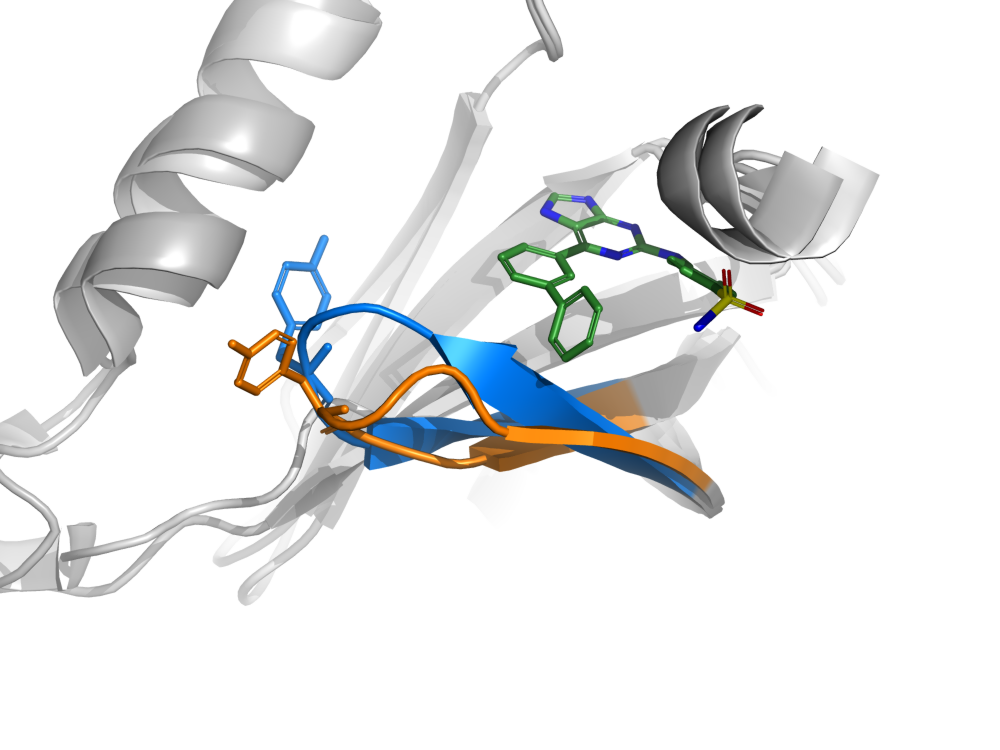

# Structural evidence for a CDK2 selectivity direction

**Decision contribution.** Preserve the C6 meta-biaryl topology as a *testable selectivity direction*, conditional on matched biochemical confirmation and adequate soluble exposure. The structures support a different glycine-rich-loop/Tyr15 state in CDK2–73 and CDK1–NU6102. They do not establish that this state causes the reported discrimination, and the deposited CDK2 ligand has substantial geometric defects. Do not use rigid docking to these two deposited poses to rank new compounds or to predict a selectivity free energy. Allocate the first useful structural/physical experiment to distinguishing conformational selection from a local contact explanation, after activity and solubility controls pass.

## Inputs and structural qualification

Only the assigned source packet, conduct rules, scientific request and assigned structural-analysis skill/shared scientific decision guidance were read. No peer/evaluator files, other tasks, external services or new literature retrieval were used. The scientific guidance informed immutable source handling, atom identity, independent numerical checks and decision-linked experiments; no private guidance content is reproduced here. Public sources are Coxon et al., *J Med Chem* 2017, 60, 1746–1767, [doi:10.1021/acs.jmedchem.6b01254](https://doi.org/10.1021/acs.jmedchem.6b01254), deposited [5NEV](https://www.rcsb.org/structure/5NEV) and [5LQF](https://www.rcsb.org/structure/5LQF), their supplied wwPDB validation reports and CCD dictionaries. All seven supplied scientific file hashes match SOURCE_METADATA.json. Article text and validation tables were extracted with pdftotext; these are derivatives, not new evidence.

| Object | Identity and deposited state | Local evidence | Scope allowed |
|---|---|---|---|
| 5NEV, revision 1.2 (2024-10-16) | Human CDK2/cyclin A2 with compound 73 (CCD 72L), successor of obsolete 5LQE. Kinase author A/C; ligand author A:301/C:301, label E/F. | 2.97 Å; both ligand copies 32/32 heavy atoms, occupancy 1, no alternate identifiers. RSCC .86/.88, RSR .17/.14, B-factor ranges 99–130/111–147 Ų. Ligand A/C have 7/6 bond and 25/15 angle outliers in validation report. | Qualitative placement/topology and protein state comparison; fails qualification as an undistorted energetic/pose reference. |
| 5LQF, revision 1.3 (2024-01-10) | Human CDK1/cyclin B1/CKS2 with NU6102 (paper compound 3; CCD 4SP). Kinase author A/D; ligand author A:301/D:301, label G/H. | 2.06 Å; both 28/28 heavy atoms, occupancy 1, no alternate identifiers. RSCC .91/.91, RSR .12/.12, B ranges 34–51/37–56 Ų. No ligand bond-length outliers; three angle outliers per copy. | Better reference for this ligand and crystal state, not evidence for binding 73 to CDK1. |

The kinase entities have expression tags and no indicated kinase substitutions in sequence-difference records; cyclin B1 has Cys→Ser conflicts at 167, 238 and 350. Full polymer sequences, differences, missing residues/atoms, assembly generators and revisions are retained in analysis.json. Declared polymer lengths include tags: CDK2 303, cyclin A2 260; CDK1 302, cyclin B1 273, CKS2 84. No declared unobserved residue/atom was found among the selected binding-site and loop positions (9–19, 31, 33, 64, 80–86, 89, 131/132, 134/135, 145/146). This is an explicit metadata check, not proof that every modeled side chain is accurate. Structure-factor maps were not independently re-refined or rescored; local evidence relies on the supplied validation report.

Each crystal contains two complexes; assembly generators use identity operation 1. All contacts were computed against the supplied asymmetric unit, preserving every original atom. No ligand–protein contacts within 4 Å crossed to a different author chain. No water oxygen within 3.5 Å of ligand heavy atoms was present. Crystal symmetry neighbors were not generated, so lattice effects remain untested and the report does not claim a complete packing analysis. The absence of modeled near-ligand waters, particularly at 2.97 Å, is not evidence against hydration.

CCD 72L is neutral C23H18N6O2S, heavy-atom count 32, InChIKey FUGRWXRQJGJIER-UHFFFAOYSA-N; CCD 4SP is neutral C18H22N6O3S, count 28, OWXORKPNCHJYOF-UHFFFAOYSA-N. Exact deposited heavy-atom names match their separate CCD dictionaries. These distinguish compound 73 from NU6102: this is **not a matched-ligand target pair**. The 72L dictionary names a 7H purine whereas alternate tautomeric encodings may appear in assay records. Hydrogens, atom-specific protonation and tautomer preference are not established by these coordinates; no protonation, tautomerization, bond-order inference from distances, hydrogen addition or ligand relaxation was done. The dictionary bond graph and descriptors are retained as chemical source records. Bond-length comparison to independent CCD *ideal* coordinates found maximal deviations 0.096/0.081 Å (72L A/C) versus 0.051/0.053 Å (4SP A/D); these diagnostic differences are not restraint z-scores and do not replace the validation table.

## Executed tests and their limitations

The primary analysis reports heavy-atom contacts ≤4.0 Å and N/O–N/O proximities ≤3.5 Å for all ligand copies. Proximity is not an angle-qualified hydrogen bond. NumPy distances were independently checked with math.dist. Sequence alignment uses BLOSUM62, gap open −10, extension −0.5; matched identical-residue Cα atoms outside loop residues 9–19 define a proper Kabsch rotation, independently checked against Bio.SVDSuperimposer. All full residue maps and mismatches are preserved. This is coordinate inspection, not a pose grader or new pose construction.

An initial same-residue-number alignment was rejected: CDK1/CDK2 have insertion-related numbering shifts, and matching identical residues at the same number retained only 60 anchors. Its script and result remain explicitly named `*_v1_same_number*`, with the result named `rejected`. It contributes no accepted cross-target inference. The corrected sequence-aligned fits use 182/180 anchors. A subsequent N-lobe sensitivity, residues 1–90 excluding the loop, uses 54 anchors to limit influence of domain movements. This sensitivity was chosen after inspecting the initial full-domain results and is exploratory, not a prespecified independent test.

| Comparison | Sequence-aligned Cα fit RMSD, Å | Tyr15 OH displacement, Å |
|---|---:|---:|
| CDK2 A versus C within 5NEV | 0.373 | 1.078 |
| CDK1 A versus D within 5LQF | 0.276 | 0.228 |
| CDK2 A versus CDK1 A, global fit | 2.438 | 11.187 |
| CDK2 C versus CDK1 D, global fit | 2.297 | 10.494 |
| CDK2 A versus CDK1 A, N-lobe fit | 1.664 | 11.474 |
| CDK2 C versus CDK1 D, N-lobe fit | 1.711 | 10.552 |

The Tyr15 side-chain difference is much larger than same-crystal copy variation and survives the alignment sensitivity. This supports the paper's different-loop-state observation. Different ligands, cyclin partners, CKS2 presence, crystal lattices, resolution and refinement remain confounders. Replicate crystal copies are not independent experiments. Global protein RMSDs themselves are descriptive, not a measure of binding selectivity.

**The exact contact narrative needs qualification.** The paper describes conserved contacting side chains and sulfonamide–Asp86 hydrogen bonds. Most observed side-chain contacts are conserved: Ile10, Ala31, Lys33 (copy-dependent), Val64, Phe80/Phe82, Asp86, Lys89, Gln131↔132, Leu134↔135 and Asp145↔146. However, under our explicit 4.0 Å criterion the nonconserved CDK2 Gln85 CG lies 3.818/3.694 Å from 73; its CDK1 equivalent is Met85. Thus literal conservation of *every* contacting side chain is cutoff-dependent. This weak apolar proximity does not establish a Q85 selectivity mechanism. His84↔Ser84 contacts here are backbone, so residue-level contact tables alone must not be mistaken for nonconserved side-chain recognition.

The 5NEV sulfonamide N6–Asp86 OD2 distances are 3.774/3.664 Å and fail the chosen ≤3.5 Å polar-proximity criterion; the two sulfonamide contacts described for the original paper are not cleanly reproduced in this successor coordinate set. A sulfonyl oxygen is 2.892/3.246 Å from Asp86 backbone N. In 5LQF, sulfonamide N26–Asp86 OD2 is 2.679/2.979 Å, and the oxygen–backbone N proximity is 3.147/3.310 Å. No favorable atom swapping or relaxation was used to recover the desired explanation. At 2.97 Å and with numerous ligand outliers, an exact sulfonamide orientation is a poor basis for medicinal chemistry optimization.

## Falsifiable contribution to compound and experiment selection

1. **Advance topology, conditionally:** retain the meta-biaryl C6 vector of 73 as a branch worth testing against a less bulky phenyl parent and a para-displaced aromatic control. These are a matched-topology experiment, not a prediction that a new analogue will improve activity. Keep the purine/anilino/sulfonamide anchor fixed initially. The distal phenyl lies by glycine-rich-loop backbone (e.g., ligand C22–Gly11 CA 3.33/3.41 Å), so topology has a structural rationale beyond bulk lipophilicity. Do not enlarge the aromatic system merely because a static pocket appears to accommodate it.
2. **Discriminate intrinsic selectivity from exposure artifacts first:** obtain same-run CDK2/cyclin A2 and CDK1/cyclin B1 activity curves for authentic 73, NU6102 and the topology controls, with measured soluble concentration, appropriate detergent/aggregation checks, independently fitted ATP conditions and orthogonal binding where feasible. Reproduce ≤100 nM CDK2 and ≥10-fold discrimination with documented comparable assay conditions before spending on an expanded structure campaign. Equal nominal ATP alone is not equal ATP/Km; characterize/normalize competition if drawing intrinsic affinity conclusions. If discrimination vanishes with matched soluble exposure or assay context, drop the structural selectivity story and redirect the chemistry.
3. **Separate local sequence from remote conformational effects:** if the selectivity is real, reciprocal CDK2 Q85M and CDK1 M85Q tests with 73 and NU6102 can examine the one nonconserved side-chain proximity identified here. Establish catalytic competence and ATP Km for mutants, and use orthogonal binding if feasible; a potency shift caused by impaired catalysis is uninterpretable. Prefer a difference-of-differences against NU6102 to a raw mutant IC50. A reproducible reciprocal differential of approximately one log unit would favor a local contribution; absence of such a shift under qualified assays deprioritizes direct Q85 recognition but does not prove the loop mechanism.
4. **Resolve the conformational alternative:** obtain a qualified higher-resolution CDK2 complex for the advancing topology analogue, and a matched-ligand CDK1 complex only if binding permits it; alternatively use solution conformational probes qualified for these proteins. The source authors could not visualize 73 in CDK1 despite attempts, so a CDK1–73 crystal is not a guaranteed 30-day dependency. Confirming the same loop state across both targets with a genuinely selective ligand would weaken the proposed conformational explanation; a paired state difference is supportive but still not a free-energy decomposition.

Mutant work and crystallography are optional mechanism follow-up after the decision-critical biochemical/exposure gate, not prerequisites to every tranche activity. Structural analysis supplies no cellular window. Cellular target engagement, CDK1 liability, intracellular exposure and genetic context remain separate necessary evidence.

## Replay, resources and completion

Run from repository root with the pinned launcher; no new packages or environments were installed:

```sh
OMP_NUM_THREADS=1 OPENBLAS_NUM_THREADS=1 MKL_NUM_THREADS=1 timeout 600 /home/zbos/.local/share/cedar-runtime/20260908/cedar-python CEDAR-SELECT/structure-work/analyze.py
OMP_NUM_THREADS=1 OPENBLAS_NUM_THREADS=1 MKL_NUM_THREADS=1 timeout 600 /home/zbos/.local/share/cedar-runtime/20260908/cedar-python CEDAR-SELECT/structure-work/sensitivity.py
```

Python 3.12.14, Biopython 1.88, NumPy 2.5.2. Accepted primary run: 1.758 s wall, 1.873 s CPU, 159208 KiB maximum RSS; sensitivity: 1.205 s wall, 1.284 s CPU, 112052 KiB. Rejected initial run: 1.744 s wall, 1.856 s CPU, 158152 KiB. Each scientific job used one declared thread, CPU only and timeout 600 s; actual memory <0.2 GiB, below the 3 GiB delegate allocation. Minor import/summary scripts and PDF text extraction completed in under one second each according to shell-tool timing. The edit helper was text-only. No background jobs, docking, simulations or delegates were started. All processes returned exit code zero and have stopped. No commits were made by this delegate; the supervisor can integrate these outputs into the final delivery.

## Independent purine alternative versus a series switch

The purine direction is an independent competing option, not the principal incumbent benzimidazole/aminopyrimidine inventory. Nor do these structures provide a binding pose for any new spiro-lactam series. Mechanistic transfer to spiro chemistry would be unsupported without its own structural evidence. This report alone cannot rank the spiro series because it did not evaluate those data.

Table 2 of the source article (journal p1751; physical PDF page 7) was rendered and visually checked because its numeric cells were embedded as an image. The source means/SD below are in nM after conversion from µM; selectivity ratios are calculated from means, not experimentally supplied confidence intervals.

| Paper compound | CDK2/A IC50 nM | CDK1/B IC50 nM | Ratio CDK1/CDK2 |
|---|---:|---:|---:|
| 3, NU6102 | 5 ± 1 | 250 ± 50 | 50 |
| 34 | 1.2 ± 0.5 | 97 ± 40 | 80.8 |
| 35 | 19 ± 1 | 940 ± 40 | 49.5 |
| 70, C6 phenyl | 24 ± 2 | 730 ± 3 | 30.4 |
| 73, C6 meta-biaryl | 44 ± 12 | 86,000 ± 4,000 | 1954.5 |

These are means of at least two independent measurements. CDK1/B and CDK2/A were both assayed at 12.5 µM ATP; the paper quotes published Km(ATP) values 0.8 and 0.58 µM respectively. Thus the paired evidence is materially more comparable than mixing unrelated assay repositories, although enzyme preparations and ATP/Km are not identical. Under a simple competitive Cheng–Prusoff interpretation with those quoted values, correcting ATP effects would multiply the ratio by approximately 1.36, not erase the discrimination; this is a mechanistic illustration, not a new Ki measurement. Historical assay details are partly referred to earlier methods, and actual batch Km measurements are not supplied. The higher 100 µM ATP used for CDK7/CDK9 makes those cross-CDK comparisons less directly transferable.

The striking 70→73 result is primarily a loss of CDK1 potency (approximately 118-fold), while CDK2 is about 1.8-fold weaker. This is a credible chemical selectivity direction with a concrete matched analogue and an assay-supported reason to preserve it as a backup. Rejecting it solely on the poor ligand geometry would discard substantive biological evidence.

The stronger reason to limit immediate expansion is the translation deficit: 73 had no or limited antiproliferative effects at the maximum 30 µM tested over 120 h in A375, Calu-6, MDA-MB-231, SJSA1 and SKUT-1B; no GI50 could be determined. This is not a measured cellular safety window. The study did not establish cellular CDK2 engagement or adequate intracellular free concentration for 73. The core alternatives 91 and 98 were approximately 100-fold biochemical CDK2/CDK1 selective and produced growth GI50 values of 1–22 µM, but this activity also does not establish on-target CDK2 selectivity. Compound73 used 0.5% DMSO, whereas other compounds used 0.1%; no inference of equal exposure follows. The five lines were Rb-proficient, not a demonstrated CDK2-dependent sensitivity panel.

**Concrete comparison recommendation:** retain authentic 73, 70 and NU6102 as an orthogonal biochemical/exposure benchmark set (or prioritize 73 plus NU6102 if material/budget restricts it). Do not require a six-compound purine synthesis expansion on the present evidence. A series with newly supported matched potency/selectivity and feasible chemistry can merit the main conditional tranche, but it must be benchmarked rather than declared better because it is newer. Restore purine73 as a main synthesis branch if it shows sustained CDK2 cellular engagement at soluble concentrations with a credible CDK1 engagement window and the competing branch fails that same test. If73 remains cellularly unengaged despite adequate extracellular solubility, its enormous enzyme ratio does not rescue it for a cellular-window programme.

## Inspected molecular view



**Figure:** N-lobe-aligned author-chain A structures. CDK2 loop residues9–19 and Tyr15 are blue; CDK1 equivalents are orange; compound73 is green with heteroatom colors; nearby protein backbone is gray. The shown73 coordinates belong only to CDK2. NU6102 is hidden for legibility, not removed from the source. All modeled atoms retain their internal geometry; only a rigid display transform places CDK2 in the CDK1 frame. The figure is a fixed crystallographic comparison, not a trajectory, a docking result or a spiro pose. The view emphasizes the Tyr15 side-chain state and C6 aryl placement; it does not imply an energetic barrier or direct Tyr15–ligand bond. Source structures, different ligands and validation limitations above apply. The PNG was opened and visually inspected: the relevant loops, side chains and ligand are visible and separated; a cropped outer cartoon is intentional context.

`render.py` replays the figure using PyMOL 3.2.0a with the recorded N-lobe fit; `render_runtime.json` retains the transform. The render used 2.008 s wall, 2.186 s CPU, maximum RSS200088 KiB, one thread, CPU only and a600 s timeout. It returned exit0; all scientific and rendering jobs are stopped. The Table2 source-page image was also visually inspected and retained as `article_table2.png`.
