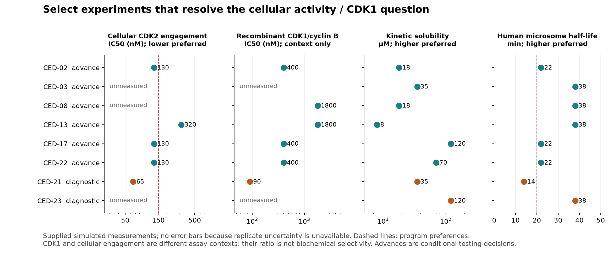

# CEDAR: fund a discriminating experimental cycle, not the vendor ranking

Advance **CED-02, CED-03, CED-08, CED-13, CED-17 and CED-22** to conditional testing. Add **CED-23** as an alternate-scaffold diagnostic and **CED-21** as an unfavorable-profile comparator. The proposed cycle costs **$17,800**, uses **eight unique vials**, and finishes by **business day 7**, leaving $200 and one day of contractual headroom. Advancement means earning this experiment, not demonstrated suitability for development. The laboratory experiments are proposed; none was performed in this computational task.

The supplied cellular, CDK1, solubility and microsomal values are **simulated program measurements on real chemical structures**. Historical ChEMBL values and deposited 1H1Q coordinates are separate public evidence. No activity was retrieved externally. [Origin and terms](../inputs/project/PROVENANCE.md) distinguish these sources.

| Compound | Role and reason to spend now | Supplied cellular IC50 / microsome half-life | Planned total / completion |
|---|---|---|---|
| CED-02 | Conditional advance; tractable member of the 130 nM group; establish matched CDK1 window | 130 nM / 22 min | $2,100 / day 7 |
| CED-03 | Conditional advance; favorable solubility/stability with both biological questions unmeasured; identity first | Unmeasured / 38 min | $2,350 / day 6 |
| CED-08 | Exploratory advance; missing cellular result despite CDK1 1,800 nM and useful stability; extra engagement repeat | Unmeasured / 38 min | $2,950 / day 7 |
| CED-13 | Explicit tradeoff experiment; stronger stability but cellular potency misses the preference; test whether a biochemical window merits focused optimization | 320 nM / 38 min | $2,050 / day 6 |
| CED-17 | Conditional advance; 120 µM solubility makes a useful comparator to 02/22 | 130 nM / 22 min | $2,050 / day 7 |
| CED-22 | Conditional advance; 70 µM solubility and a close structural comparator to 17 | 130 nM / 22 min | $2,100 / day 6 |
| CED-23 | Diagnostic alternative scaffold; biological activity is unknown despite structural parent connection | Unmeasured / 38 min | $2,150 / day 7 |
| CED-21 | Diagnostic; strong engagement coexists with CDK1 90 nM and short half-life; test, rather than assume, a poor matched window | 65 nM / 14 min | $2,050 / day 5 |

Order **CDK2-E1, CDK1-B and ENGAGE for all eight compounds**. Order **IDENTITY on VIAL-03 before its biology**, and **two total ENGAGE experiments for CED-08**. These are separately prepared concentration-response experiments, charged twice and run in parallel. All other combinations have one replicate. The [experiment manifest](experiments.csv) contains 25 combinations / 26 charged menu experiments. Handling is $1,850 and assays $15,950. Summed material is 0.35 mg per usual package, 0.40 mg for CED-03 and 0.50 mg for CED-08; all fit stock. Arrival plus identity, when ordered, plus longest parallel duration defines completion. This is a single scheduled package, not an unfunded result-dependent second wave. [Per-vial accounting](../analysis/cycle_accounting.csv) preserves each calculation.

Quarantine STOCK-27's invalid SMILES and STOCK-28's graph/identifier conflict; never pool VIAL-CONFLICT with VIAL-03. STOCK-25/26 duplicate existing physical vials and add no material. A passing identity check on VIAL-03 establishes the intended stock identity/purity within that test's resolution; it cannot retrospectively settle historical measurement attribution. If identity fails, stop its biology/interpretation and leave cancelled costs unspent. CED-05's 72% purity remains unresolved and would require identity/purity work before new biological interpretation; it is not selected.

The opportunity costs are deliberate. CED-07 offers the same supplied engagement/CDK1/half-life as 02/17/22 with poorer solubility; CED-18 is less soluble than 13; CED-24 is less soluble than the alternate-scaffold diagnostic 23. CED-04/12 arrive on day 10 and cannot qualify. CED-19's stability/CDK1 profile is interesting but its 850 nM cellular result is a larger potency gap than 13's. Several potent, unstable compounds are represented by one comparator, 21. Replacing the extra CED-08 engagement run with two microsomal repeats would cost $17,650 and clarify borderline 22-minute values, but the missing engagement result for 08 is more likely to change the immediate route forward. Existing half-life values, especially 22 minutes, remain unreplicated uncertainties. All [28 stock decisions](selection.csv) include their reasons; [inventory chemical drawings](figures/selected_chemical_structures.png) preserve supplied states.

Use the new **matched 1 mM ATP CDK1-B/CDK2-E1 IC50 ratio** as an assay-specific biochemical window. CDK1 IC50 divided by cellular target engagement is **not** that selectivity measurement. As a team-selected working next-cycle gate, require identity-qualified engagement below 150 nM, an interpretable matched biochemical window of at least tenfold, half-life above 20 minutes and sufficient soluble exposure for the curves. Tenfold is a decision preference introduced here, not a supplied threshold or a clinical safety margin. Record actual assay protocols and curve qualification; do not assume historical and new assays are interchangeable. Single new curves and unreplicated stability support only provisional continuation, not precision claims.

Concordant favorable CED-08 engagement runs plus the matched window support another cycle; concordant weak engagement removes that route, and discordance leaves it unresolved. Persistent 320 nM engagement in CED-13 is not a potency pass even if its window is strong; that outcome supports at most a specific cellular-translation optimization hypothesis. If CED-21 is matched-selective, revise its presumed unfavorable-window role. CED-23 earns further work only through new biological evidence. If no clean candidate combines cellular activity and a matched window, stop broad progression and define the narrow missing mechanism or assay evidence before another cycle. Cellular CDK1 engagement and viability are unavailable on this menu and remain prerequisites to any later cellular-safety claim.

The vendor model has **no prospective prioritization role**. Its original script reproduces R² **0.960**, MAE **0.067**, on 262 mixed, legacy-normalized random-split rows. Its activity index was explicitly populated after results and is absent from candidate inputs. Pooling assays, treating bounds as points, flawed normalization and repeated-row leakage further undermine that score. The actual original split shares one source activity ID and nine chemical graphs between training and test ([overlap audit](../analysis/legacy_split_overlap.json)). The original result is retained, not presented as a corrected validation.

A frozen exploratory audit used only source-reconciled exact CHEMBL5736732 IC50 labels, with full-graph/scaffold/representation collision groups and fixed models on common folds. Each chemical has total weight one. There were 122 rows, 117 graphs and 26 scaffold groups, with test folds of 66/22/12/11/11 rows. No hyperparameter tuning, external model, hidden holdout or temporal claim was used.

| Common-fold control | MAE (log pIC50) | R² |
|---|---:|---:|
| Training-only mean | 0.566 | −0.446 |
| Nearest chemical, Morgan/Tanimoto | 0.509 | −0.637 |
| Random forest, three structure descriptors | 0.539 | −0.603 |
| Random forest with retrospective index — unavailable prospectively | 0.042 | 0.984 |

The three supplied descriptors exactly match independent RDKit recomputation; the retrospective index correlates 0.999609 with curated activity. Scaffold separation does not cure a result-derived feature. The original-to-curated score change also changes cohort, normalization and weighting; it does not isolate the effect of splitting alone. Structure-only errors and negative R² provide no robust utility case; nearest-neighbor improves MAE modestly while worsening RMSE. These are historical-export controls, **not cellular models**. [Diagnostics](figures/model_diagnostic.png), [partitions](../analysis/model_partitions.csv), [metrics](../analysis/model_summary.json) and [pre-fit protocol](../analysis/MODEL_PLAN.md) retain the evidence. Scaffold folds remain chemically related and uneven, rather than independent future series. The planned permutation control was explicitly omitted because repeated source labels and unresolved assay context do not supply a unique experimental permutation unit; no null-test claim is made.

All 266 activity rows are accounted for: **122 eligible for this narrow historical audit, 138 context, two reingestion duplicates, four quarantined**. All 258 comparisons to supplied original activity records match after unit/graph reconciliation. Eligible means source-faithful and suitable for the declared exploratory export endpoint, not experimentally validated cellular labels. CHEMBL5736732 describes multiple kinases/cyclins (including CDK2/A2 at 15 µM ATP and CDK2/E1 at 20 µM); its supplied row metadata do not resolve every row to a particular cyclin. It cannot be relabeled the new E1/1 mM assay. Five graphs recur under distinct source activity IDs; one differs by 1.538 log units. These remain separate observations with uncertain independence, grouped in evaluation. Source potential-duplicate flags are not proof of ingestion duplication. Bounds, other assays, Ki and fictional QC examples remain context. Source qualifiers were preserved, not clamped or upgraded to exact labels. For context assay CHEMBL3705366, exported >15 µM bounds exceed the protocol description's 10 µM upper concentration; this unresolved range inconsistency stays explicit context rather than an invented corrected threshold. [Detailed curation](../analysis/curation_details.csv) retains lineage.

The [prediction table](predictions.csv) answers the current endpoint: 18 traceable simulated SIM-TE-01 observations, six unmeasured abstentions, two duplicate exports and two quarantines. No candidate has a learned cellular point estimate or fabricated interval. Numeric cells on valid bounded curation rows represent thresholds with the stated reversed relation; they are not exact training targets. Source historical matches are separately labeled observations in [historical context](../analysis/inventory_historical_context.csv).

Replace the old structural presentation with the [deposited-site/frame audit](figures/structure_comparison.png). 1H1Q is a 2.5 Å CDK2/cyclin A structure; the assessed ligand is NU6094/2A6, author chain A residue 1298, 24 heavy atoms. The reordered reference export has **0.000 Å** fixed-frame RMSD. The priority export is translated **[8, −3, 2] Å**, giving **8.774964 Å**, with a **0.685 Å** protein overlap. It is unusable for contacts. RDKit 2026.03.6 supports in-place symmetry-aware atom mapping; an independent raw-coordinate calculation and identity/frame controls agree. Ligand-only fitting would yield zero and conceal the defect. No repair, preparation or docking was performed; use the authentic deposited coordinates.

Hinge-region polar distances support a geometric interpretation, not interaction energies, selectivity or cellular engagement. Local electron-density/ligand-validation evidence is absent; deposited Rfree is 0.332, so global resolution alone cannot certify the site. CED-23 and the SDF share a tautomer-normalized parent but differ in supplied atom-specific hydrogen placement. The figure depicts the deposited state, not a proved stock pose or pose for the other series. [Structural evidence and limitations](../analysis/structure_notes.md) and [machine-readable checks](structure_checks.json) preserve mapping, source hashes and controls.

The compatible [assay helper repair](../analysis/assay_math.py) fixes unit handling, endpoint preservation, log-inequality reversal and invalid-value rejection. The immutable baseline failed 29 of 39 author checks; the repaired file passed all 39 plus 12 independently authored analytic checks. Its patch reconstructs the tested bytes. These verify the mathematical contract, not assay validity. Reproduction commands and remaining execution limits are in [REPRODUCE.md](REPRODUCE.md); the scoped reusable handoff is [NEXT_BATCH.md](NEXT_BATCH.md). AIDD expertise was consulted; native captured execution was not configured or claimed. Administrative guidance/environment source files remain local after automatic approval review; generated usage/progress records and all scientific delivery are committed privately.
